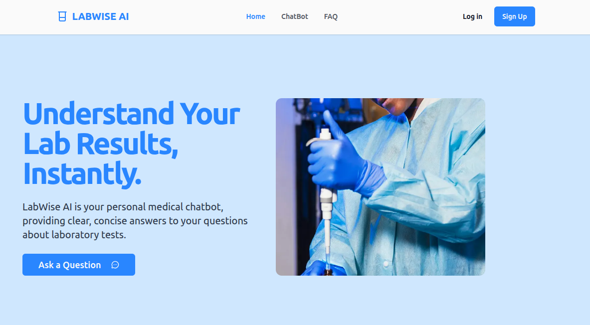
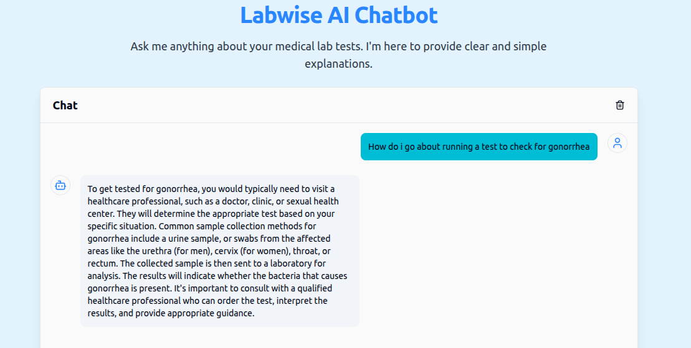

# 🔬 LabWise AI

> An intelligent, personal medical chatbot designed to demystify clinical diagnostics. LabWise AI provides clear, concise, and accessible insights into complex laboratory test results, bridges the communication gap between patients and medical reports, and promotes informed health literacy.

[Live Demo](https://labwise-ai.vercel.app/) | [Report Bug](https://github.com/Nnenna-udefi/labwise-ai/issues)

---

## 🛠️ Tech Stack

LabWise AI leverages a robust, production-ready stack designed for speed, security, and smooth user experience:

- **Framework & UI:** Next.js (App Router), React, Tailwind CSS, Radix UI, Lucide React
- **Backend & Database:** Supabase (Authentication & Database storage)
- **AI & Orchestration:** Google Gemini API, Firebase Genkit (`genkit-ai`)

---

## ✨ Features

- 💬 **Context-Aware Medical Conversationalist:** Powered by the Gemini API to break down complex medical jargon (e.g., hematology panels, metabolic profiles) into digestible, safe, and clear explanations.
- 🏗️ **Structured AI Workflows:** Built using **Genkit AI** to manage prompts, handle structured schemas, and ensure robust, predictable AI responses.
- 🔐 **Secure Session Management:** Integrated with Supabase Auth to guarantee user privacy, data isolation, and secure storage for user queries.
- 🎨 **Accessible & Fluid UI:** Fully accessible design primitives courtesy of Radix UI, wrapped in a polished, responsive interface styled with Tailwind CSS.

---

## 📸 Architecture & Preview

<!-- Place an application screenshot, UI mockup, or component flow diagram here -->




---

## ⚙️ Local Development Setup

Follow these steps to clone the repository and run LabWise AI in your local environment.

### Prerequisites

Ensure you have **Node.js (v18+)** and **npm/pnpm** installed.

```bash
node -v
npm -v
```

## Installations

```bash
git clone [https://github.com/nnennaudefi/labwise-ai.git](https://github.com/nnennaudefi/labwise-ai.git)

cd labwise-ai
```

## Install project dependencies

```
npm install
```

## Configure Environment Vaiiables

Create a .env.local file in the root of your directory and add your development keys:

```bash
# Supabase Configuration
   NEXT_PUBLIC_SUPABASE_URL=your_supabase_project_url
   NEXT_PUBLIC_SUPABASE_ANON_KEY=your_supabase_anon_key

# Gemini API Key
   GEMINI_API_KEY=your_google_gemini_api_key
```

## Initialize Genkit (Optional for prompt development)

If you wish to experiment with or modify the Genkit schemas using the local Developer UI, run:

```bash
npx genkit start
```

## Run the Next.js development server

```bash
npm run dev
```

Open http://localhost:3000 in your browser to interact with the application.

# ⚠️ Disclaimer

LabWise AI is an educational tool meant to increase diagnostic literacy and aid communication. It does not provide official medical diagnoses, replace professional clinical evaluation, or substitute the direct oversight of licensed Medical Laboratory Scientists or Physicians.

# License

MIT License

# Author

- [Nnenna Udefi](https://github.com/Nnenna-udefi)
